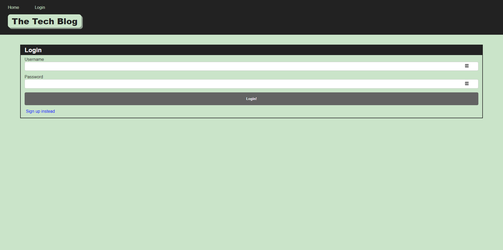

# The-Tech-Blog

## Description
This application is a blog that allows users to create an account where they can create, edit, and view posts about technology. Additionally, when logged in, users can comment on any posts in the homepage.

## Table of Contents
  * [Installation](#installation)
  * [Usage](#usage)
  * [Questions](#questions)

## Installation
To install any dependencies run: npm install. 

If ran locally, be sure to create a .env file in the same directory as the index.js file and populate the .env file with the DB_NAME, DB_USER, and DB_PW. Also be sure to source the schema using the terminal and populate the tables with the seeds by running npm run seed. Run the program by entering the command node server.js in your CLI.

## Usage
This application can be accessed via the following [Heroku app.](https://fast-coast-84513.herokuapp.com/) or run locally (see installation above for instructions).

To be able to add posts or comments, simply login or signup.

To navigate to the login page, simply click login in the navigation bar at the top of the page: 

If you do not have an account yet, click on "Sign up instead" in the login page to create an account:

Once logged in, you can add posts by clicking on the "+ New Post" button in the dashboard:

## Questions
For any questions, reach out to github.com/djamz919 via the following email address: djtm97@gmail.com.